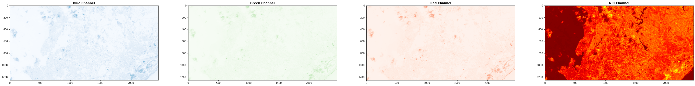
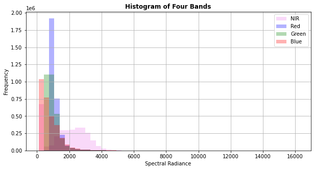
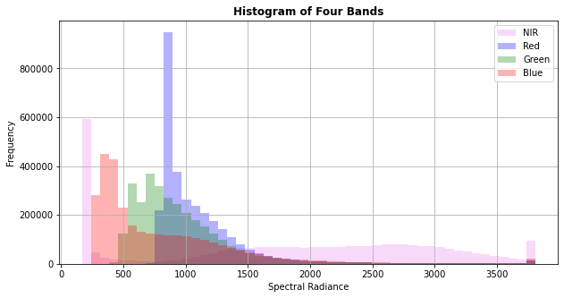
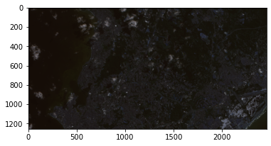
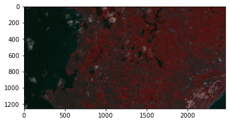
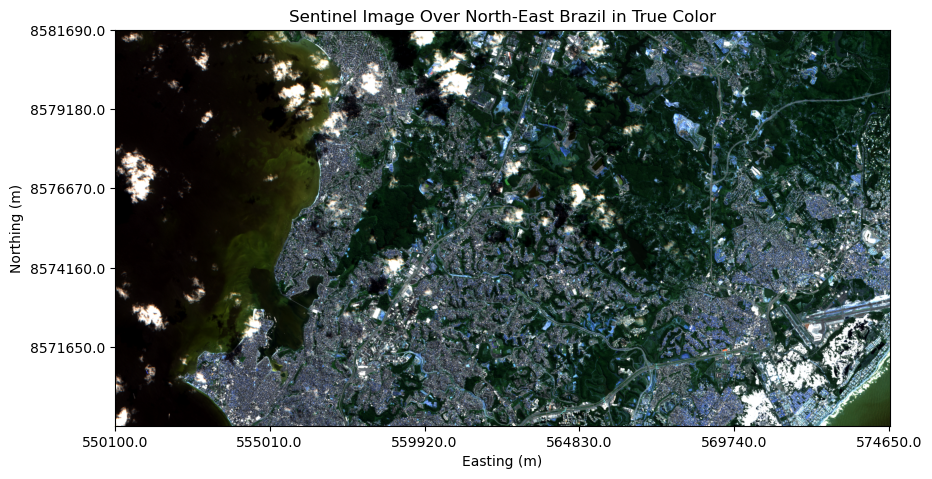
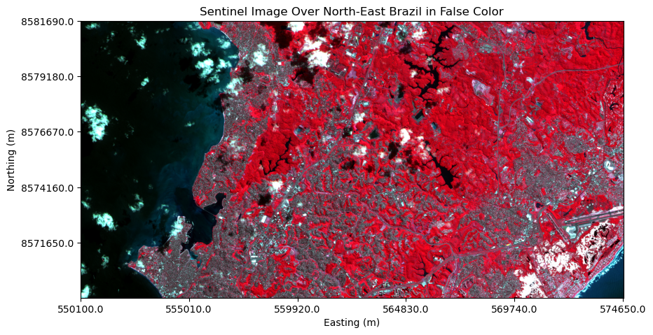
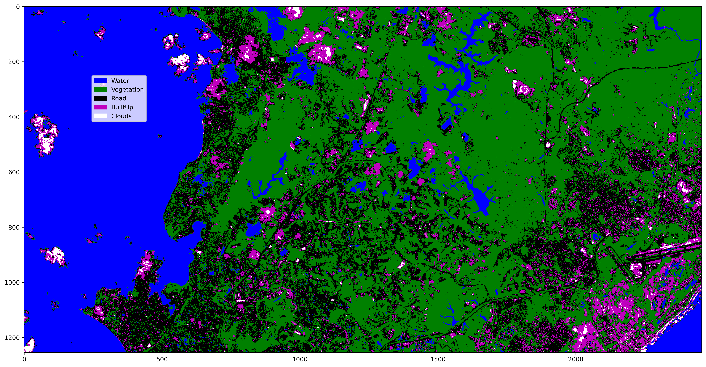

# Classification of Sentinel Image Using Decision Tree

**Aim of the Project**: 

This project conducts classification on Sentinel image using Decision Tree to produce land-cover map. The Sentinel image was taken on 29 July 2020 over the North-Eastern region of Brazil. For the purposes of the project, the image was cropped to cover a region that includes Salvador City, where a large slum exists.

**Disclosures and References**: 

1) Sections on training and running classifier is adapted from the exercise that was developed for the course "Advanced Image Analysis" at ITC. Anurag Kulshretha provided help in learning image classification method in Python and helped me debug errors associated with geopandas and Pyproject.

**Other sources that were consulted are**:

2) Introduction to Earth Data Science Textbook. Earth Lab CU Boulder.
https://www.earthdatascience.org/courses/intro-to-earth-data-science/

3) Intermediate Earth Data Science Textbook. Earth Lab CU Boulder. 
https://www.earthdatascience.org/courses/use-data-open-source-python/

4) Python Open Source Plotting Guide for Scientists. Earth Lab CU Boulder.
https://www.earthdatascience.org/courses/scientists-guide-to-plotting-data-in-python/

5) Intro to Python GIS. https://automating-gis-processes.github.io/CSC/index.html

6) "Tutorial: Band Stacking, RGB & False Color Images, and Interactive Widgets in Python - Tiled Data". NEON. https://www.neonscience.org/resources/learning-hub/tutorials/neon-hsi-aop-functions-tiles-py

7) Advanced Analysis of Satellite Imagery Using Python. Esri Events. https://www.youtube.com/watch?v=Jg7IcrpBfK4&ab_channel=EsriEvents

8) Hands-on Satellite Imagery Analysis. Scipy 2019 Tutorial. https://www.youtube.com/watch?v=j15MryznWn4&ab_channel=Enthought

9) StackExchange and StackOverflow

### Import libraries


```python
import sys
import numpy as np
from osgeo import gdal
from osgeo import ogr
import matplotlib.pyplot as plt
from matplotlib.pyplot import figure
import matplotlib.patches as mpatches
import os
import geopandas as gpd
import pandas as pd
import earthpy as ep
from shapely.geometry import Point
import rasterio as rio
from rasterio.mask import mask
from rasterio.plot import show
from rasterio.plot import show_hist
from sklearn.model_selection import train_test_split
from sklearn.ensemble import RandomForestClassifier
from sklearn.metrics import accuracy_score
from sklearn.metrics import confusion_matrix
from sklearn import tree
```

### Download Sentinel image

The Sentinel image for the North-East Brazil was downloaded from EarthExplorer https://earthexplorer.usgs.gov/. The image was imported into QGIS and cropped in spectral domain as well as spatial domain to focus on Salvador, Brazil. Following this, test and training polygons were also created in QGIS. Thereon, classification is carried out in Jupyter Notebook.

### Read images

Read in and check the Sentinal data for dimension, bounding box, crs, and nodata values


```python
# Define path for where image, training, and test data are stored
# Image
sentinel_image_name = "C:/Users/surak/Documents/PythonProjects/classification_sentinel_image/data/SentinelRGB_NIR_cropped.tif"
# Training data
training_shp = 'C:/Users/surak/Documents/PythonProjects/classification_sentinel_image/data/Train_Test_Sets/TR.shp'
# Test data
test_shp = 'C:/Users/surak/Documents/PythonProjects/classification_sentinel_image/data/Train_Test_Sets/TS.shp'


# Read in the sentinel image data
img = rio.open(sentinel_image_name)

# Store data into two dimensional array
img_arr = img.read()

# Get geographic transformation data for the image
img_gt = img.read_transform()
print(img_gt)

# Get band information
num_bands = img.count
ind_bands = img.indexes   # Starts with one as starting index and not zero

# Set band information
nR,nG,nB,nNIR = 2,1,0,3   # This is the order of band stacking in the cropped TIFF file.
band_names = ['Blue', 'Green', 'Red', 'NIR']
```

    [550100.0, 10.0, 0.0, 8581690.0, 0.0, -10.0]
    


```python
print("Number of bands is: ", num_bands)
print("Dimension of the raster is: ", img_arr.shape)   # or, get the info from img.width and img.height
print("Bounding box for the image is: ", img.bounds)
print("Projection for the raster is: ", img.crs)
print("Band indexes are: ", ind_bands)   # 1 is blue band, 2 green, 3 red, and 4 nir as stacked
```

    Number of bands is:  4
    Dimension of the raster is:  (4, 1255, 2457)
    Bounding box for the image is:  BoundingBox(left=550100.0, bottom=8569140.0, right=574670.0, top=8581690.0)
    Projection for the raster is:  EPSG:32724
    Band indexes are:  (1, 2, 3, 4)
    


```python
# Access metadata needed for image processing
img.profile   # Important to note that there are no nodata values
```


    {'driver': 'GTiff', 'dtype': 'uint16', 'nodata': None, 'width': 2457, 'height': 1255, 'count': 4, 'crs': CRS.from_epsg(32724), 'transform': Affine(10.0, 0.0, 550100.0,
           0.0, -10.0, 8581690.0), 'tiled': False, 'interleave': 'pixel'}


**Alternative Method**

Read in image data using GDAL


```python
Image  = gdal.Open(sentinel_image_name)

nBands = Image.RasterCount      # number of bands making up the image
nRows  = Image.RasterYSize      # number of rows
nCols  = Image.RasterXSize      # number of columns
```


```python
print("nBands =", nBands,'\n' "nRows =", nRows,'\n' "nCols =", nCols)

```

    nBands = 4 
    nRows = 1255 
    nCols = 2457
    

Check for no data values


```python
B1   = Image.GetRasterBand(1) # Band 1 (takes only one band)
B2   = Image.GetRasterBand(2) # Band 2
B3   = Image.GetRasterBand(3) # Band 3
B4   = Image.GetRasterBand(4) # Band 4

NoData_B1 = B1.GetNoDataValue()  # Check for no data values
NoData_B2 = B2.GetNoDataValue()
NoData_B3 = B3.GetNoDataValue()
NoData_B4 = B4.GetNoDataValue()
```


```python
print("NoData_B1 =", NoData_B1,'\n' "NoData_B2 =", NoData_B2,'\n' "NoData_B3 =", NoData_B3, '\n' "NoData_B4 =", NoData_B4)

```

    NoData_B1 = None 
    NoData_B2 = None 
    NoData_B3 = None 
    NoData_B4 = None
    


```python
fig, axs = plt.subplots(1, 4, figsize = (50, 50))

# Show blue band
show((img.read(1)), ax=axs[0], cmap="Blues", title = "Blue Channel")
# Show green band
show((img.read(2)), ax=axs[1], cmap="Greens", title = "Green Channel")
# Show red band
show((img.read(3)), ax=axs[2], cmap="Reds", title = "Red Channel")
# Show nir band
show((img.read(4)), ax=axs[3], cmap="jet_r", title = "NIR Channel")

```


    <AxesSubplot:title={'center':'NIR Channel'}>


    

    


### Create histogram

The first histogram indicates that the data has outliers. Hence, a second histogram is created by removing the outliers.

Removing outliers will enhance image visualization.


```python
# Note: the only way to change the legend color, that is, ...
# ... to have red color for Red band and so on, is to modify the source code ...
# ... where show_hist is pulling information to construct the figure legend.

fig, ax = plt.subplots(figsize=(10, 5))
show_hist((img_arr), ax=ax, bins=50, lw=0.0, stacked=False, 
          alpha=0.3, histtype="stepfilled", 
          title="Histogram of Four Bands", label=["Blue","Green","Red","NIR"])
ax.set_xlabel("Spectral Radiance")
ax.legend()
```


    <matplotlib.legend.Legend at 0x2128df6afd0>


    

    


```python
# Outliers are clipped

fig, ax = plt.subplots(figsize=(10, 5))
show_hist(np.clip(img_arr, *np.percentile(img_arr,(1,99))), ax=ax, bins=50, lw=0.0, stacked=False, 
          alpha=0.3, histtype="stepfilled", 
          title="Histogram of Four Bands", label=["Blue","Green","Red","NIR"])
ax.set_xlabel("Spectral Radiance")
ax.legend()
```


    <matplotlib.legend.Legend at 0x2128dfe1430>


    

    


### Visualize the image

**Visualize the image as true color and false color**

To visualize the Sentinel image as true color, use the combination of red as red, green as green, and blue as blue. 

To visualize the Sentinel image as false color, use the combination of NIR as red, red as green, and green as blue. Since plants reflect more NIR than green, the densely vegetated areas in the image will appear dark red. The water will appear dark, clouds bluish, and built-up areas grey.


```python
def scale(band):   # To scale band values for display
    return band / 10000.0

# True color composite
img_composite = np.dstack((scale(img.read(3)), scale(img.read(2)), scale(img.read(1))))   
plt.imshow(img_composite)

# Shows the image, but it is quite dark --> enhance visualization by histogram stretching
# Take image coordinates to geographic coordinates
```

    Clipping input data to the valid range for imshow with RGB data ([0..1] for floats or [0..255] for integers).
    


    <matplotlib.image.AxesImage at 0x2128e664850>


    

    


```python
# False color composite
img_fcomposite = np.dstack((scale(img.read(4)), scale(img.read(3)), scale(img.read(2))))   
plt.imshow(img_fcomposite)

# Shows the image in false color, but it is quite dark --> enhance visualization by histogram stretching
# Take image coordinates to geographic coordinates
```

    Clipping input data to the valid range for imshow with RGB data ([0..1] for floats or [0..255] for integers).
    


    <matplotlib.image.AxesImage at 0x2128e6c6640>


    

    


```python
# Write a function to plot image
# Three things need to be done to plot the image:
# 1) to show geographic coordinates on y and x axes, convert image coordinate to geopraphic coordinate
# 2) to enhance image visualization, remove very high and very low radiance values - histogram stretch
# 3) decide what elements to display

def pixel_id_to_lat(GT, Y):   # To create tick marks on map that represent latitude 
    lat=GT[5]*Y + GT[3]
    return lat
   

def pixel_id_to_lon(GT, X):   # To create tick marks on map that represent longitude 
    lon=GT[1]*X + GT[0]
    return lon
     
# Conversion to geographic coordinates can also be achieved with rasterio's transform function.
# img.tranformm * (row_index, column_index)

    
def coord_to_pixel_id(GT, lat, lon ):   # To convert geographical coordinates to image coordinates
    Y=(lat-GT[3])//GT[5]
    X=(lon-GT[0])//GT[1]
    return (X,Y)


def hist_stretch_all(arr, bits, clip_extremes):   # To enhance image visualization, remove very high and very low values
    n=arr.shape
    per=np.percentile(arr,[2.5, 97.5])   # get the 2.5 and 97.5 percentile values
    per_max=per[1]   # Store the 97.5 percentile value
    per_min=per[0]   # Store the 2.5 percentile value
    min_arr=np.full(n, per_min)   # Return a new array of the shape and type of n, filled with per_min value
    max_arr=np.full(n, per_max)   # # Return a new array of the shape and type of n, filled with per_max value
    if(clip_extremes==False):
        new_arr=arr
    else:
        new_arr=np.maximum(min_arr, np.minimum(max_arr, arr))   # np.minimum returns element-wise minimum of array elements
    if(bits==0):
        min_=np.amin(new_arr)   # Return the minimum of the new_arr
        max_=np.amax(new_arr)   # Return the maximum of the new_arr
        new_arr=(new_arr-min_)/(max_-min_)
    else:
        new_arr=np.floor((2**bits-1)*(new_arr-per_min)/(per_max-per_min))
    return new_arr


def display(arr, img_gt, cmap, x_label, y_label, title, num_ticks=5, colorbar=True):   # Elements to be displayed
    figure(num=None, figsize=(10, 10), dpi=100, facecolor='w', edgecolor='k')
    imgplot=plt.imshow(arr, cmap=cmap)
    
    plt.xlabel(x_label)
    plt.ylabel(y_label)
   
    plt.title(title)
    lat_pixels=list(range(0,arr.shape[0],arr.shape[0]//num_ticks))   # Sampling rows to set latitude tick marks
    lon_pixels=list(range(0,arr.shape[1],arr.shape[1]//num_ticks))   # # Sampling columns to set longitude tick marks
    
    # To plot in geographic coordinate system
    plt.xticks(lon_pixels, [str(round(pixel_id_to_lon(img_gt,i),2)) for i in lon_pixels])
    plt.yticks(lat_pixels, [str(round(pixel_id_to_lat(img_gt,i),2)) for i in lat_pixels])
    
    if colorbar:
        plt.colorbar()
        
    
    plt.show()
    

def plot_image(img_arr, img_gt, rgb_bands, clip_extremes=False, title=''):   # Plot image
    r=hist_stretch_all(img_arr[rgb_bands[0]], 0, clip_extremes)
    b=hist_stretch_all(img_arr[rgb_bands[2]], 0, clip_extremes)
    g=hist_stretch_all(img_arr[rgb_bands[1]], 0, clip_extremes)
    img = np.dstack((r,g,b))
    display(img, img_gt, None, "Easting (m)", "Northing (m)", title, num_ticks=5, colorbar=False)

```


```python
# Plot true color image
rgb_bands = (nR, nG, nB)
clip_extremes = True    
plot_image(img_arr, img_gt, rgb_bands, clip_extremes=clip_extremes, title="Sentinel Image Over North-East Brazil in True Color")
```


    

    


```python
# Plot false color image
rgb_bands = (nNIR, nR, nG) # incorporates both visible and non-visible NIR
clip_extremes = True    
plot_image(img_arr, img_gt, rgb_bands, clip_extremes=clip_extremes, title="Sentinel Image Over North-East Brazil in False Color")
```


    

    


 ### Create Training Dataframe


```python
# What we have from QGIS are training polygons.
# We need to read in the training polygons and extract values of image pixels that correspond to the training polygons.
# Then, we need to store those values in a dataframe.

def get_overlapping_pixels(img_name, classwise_polygons):
    with rio.open(img_name) as src:
         # To get the pixels overlying the training/test polygons only
             # Get training/test polygons only by masking the image
             # rasterio.mask.mask creates a masked or filled array using input shapes. 
             # Pixels are masked or set to nodata outside the input shapes, unless invert is True.
        classwise_images = [mask(src, i.geometry, crop=False)[0][0] for i in classwise_polygons]
                  
        # Give the row and columns of pixels that are not 0
        train_test_set_loc = [np.where(image!=0) for image in classwise_images]
        # print(train_test_set_loc)   # Check
        
        # Create a new dataframe
        df = pd.DataFrame(columns = [*band_names, 'Class'])

        for i,Class in enumerate(classes_legend):
            # Extract data
                # img_arr[:,train_test_set_loc[i][0], train_test_set_loc[i][1]] results in a wide-form data
                # Use transpose (T) to convert the data to long-form
            data = img_arr[:,train_test_set_loc[i][0], train_test_set_loc[i][1]].T
            
            # Fill the data into the dataframe
            df_class = pd.DataFrame(data, columns=band_names)   
            
            # Create a new column named "Class"
            df_class['Class'] = np.repeat(str(Class),train_test_set_loc[i][0].size).T
            df_class = df_class.where(df_class!=0).dropna()

            df = pd.concat([df,df_class])
    return df


shapefile = gpd.read_file(training_shp)


# Load the training and testing sets
TR_shp = gpd.read_file(training_shp)
TS_shp = gpd.read_file(test_shp)

# Print unique classes in the training set
classes =  shapefile["ClassName"].unique()
classes_legend = np.arange(1,classes.size+1)
print('Class legend')
print(classes)
print(classes_legend)

classwise_polygons_TR = [TR_shp.where(TR_shp["ClassName"]==Class, inplace=False).dropna() for Class in classes]
# print([classwise_polygons[i]['Class'].value_counts() for i in range(len(classes))])

classwise_polygons_TS = [TS_shp.where(TS_shp["ClassName"]==Class, inplace=False).dropna() for Class in classes]
# print([classwise_polygons[i]['Class'].value_counts() for i in range(len(classes))])

TR_df = get_overlapping_pixels(sentinel_image_name, classwise_polygons_TR)
TS_df = get_overlapping_pixels(sentinel_image_name, classwise_polygons_TS)


print('Training data shape:', TR_df.shape)
print('Test data shape:', TS_df.shape)


#Let's see the class count
print('Training data classwise counts \n', TR_df['Class'].value_counts())
print('Testing data classwise counts \n', TS_df['Class'].value_counts())

train_x, test_x, train_y, test_y = TR_df.iloc[:,:-1],TS_df.iloc[:,:-1],TR_df.iloc[:,-1],TS_df.iloc[:,-1]


# Train and Test dataset size details
print ("Train_x Shape :: ", train_x.shape)
print ("Train_y Shape :: ", train_y.shape)
print ("Test_x Shape :: ", test_x.shape)
print ("Test_y Shape :: ", test_y.shape)
```

    Class legend
    ['Water' 'Vegetation' 'Road' 'BuiltUp' 'Clouds']
    [1 2 3 4 5]
    Training data shape: (1583, 5)
    Test data shape: (9484, 5)
    Training data classwise counts 
     5    794
    2    557
    1    136
    4     62
    3     34
    Name: Class, dtype: int64
    Testing data classwise counts 
     1    6852
    5    1205
    2    1196
    4     177
    3      54
    Name: Class, dtype: int64
    Train_x Shape ::  (1583, 4)
    Train_y Shape ::  (1583,)
    Test_x Shape ::  (9484, 4)
    Test_y Shape ::  (9484,)
    

## Decision Trees


```python
# Define a function for the decision tree classifier
def decision_tree_classifier(features, target, options=None):
    if options:
        clf = tree.DecisionTreeClassifier(**options)
        #print('options lag gaye')
    else:
        clf = tree.DecisionTreeClassifier()
    clf.fit(features, target)
    return clf
```

Define the hyper-paramerter for the Decision Tree Classifier. 
Details for the classifier can be found [here](https://scikit-learn.org/stable/modules/generated/sklearn.tree.DecisionTreeClassifier.html#sklearn.tree.DecisionTreeClassifier)


```python
d_tree_options = dict(
    criterion = 'gini', 
    splitter = 'best', 
    max_depth = 10,
    min_samples_split = 10, 
    min_samples_leaf = 1, 
    min_weight_fraction_leaf = 0.0, 
    max_features = None, 
    random_state = 10, # Controls the randomness of the estimator. 
                       # To obtain a deterministic behaviour during fitting,  
                       # random_state has to be fixed to an integer. 
    max_leaf_nodes = None, 
    min_impurity_decrease = 0.0, 
    #min_impurity_split = None,   # parameter removed from release of scikit-learn 1.0.0
    class_weight = None, 
    )
```

### Train the classifier


```python
trained_model = decision_tree_classifier(train_x, train_y, d_tree_options)

print ("Trained model :: ", trained_model)
```

    Trained model ::  DecisionTreeClassifier(max_depth=10, min_samples_split=10, random_state=10)
    

### Test the accuracy of the classification


```python
predictions = trained_model.predict(test_x)

#for i in range(0, 5):
    #print ("Actual outcome :: {} and Predicted outcome :: {}".format(list(test_y)[i], predictions[i]))

# Train and Test Accuracy
print ("Train Accuracy :: ", accuracy_score(train_y, trained_model.predict(train_x)))
print ("Test Accuracy  :: ", accuracy_score(test_y, predictions))

print (" Confusion matrix \n", confusion_matrix(test_y, predictions))

# The numbers in the confusion matrix may change, because everytime a decision tree is run a different sample is taken.
# To make the result reproducible, see
```

    Train Accuracy ::  0.9962097283638661
    Test Accuracy  ::  0.9841838886545762
     Confusion matrix 
     [[6852    0    0    0    0]
     [   0 1192    4    0    0]
     [   0    0   49    5    0]
     [   0    0   10  117   50]
     [   0    0    0   81 1124]]
    

### Create image dataframe


```python
def make_data_frame(img_arr, col_names):
    shp=img_arr.shape
    print(shp)
    #return 0
    if len(shp)>2:
        data=img_arr.flatten().reshape(shp[0],shp[1]*shp[2]).T
    else:
        data = img_arr.flatten()
    df=pd.DataFrame(data, columns=col_names)
    df=df.where(df!=0)
    print(df)
    return df

df=make_data_frame(img_arr, band_names)
#df['Easting']=pixel_id_to_lon(img_gt, np.arange(df.shape[0])%img_arr.shape[2])
#df['Northing']=pixel_id_to_lat(img_gt, np.repeat(np.arange(img_arr.shape[1]), img_arr.shape[2]))
```

    (4, 1255, 2457)
             Blue  Green   Red  NIR
    0         323    573   858  179
    1         320    567   865  180
    2         325    550   867  185
    3         317    549   850  185
    4         297    552   856  190
    ...       ...    ...   ...  ...
    3083530   382    774   954  201
    3083531   377    757   962  192
    3083532   395    769   986  196
    3083533   390    779  1015  220
    3083534   358    769   994  206
    
    [3083535 rows x 4 columns]
    

### Run the  trained algorithm on the image dataframe


```python
print(df.shape)
predictions_image = trained_model.predict(df)


print(predictions_image.shape)
```

    (3083535, 4)
    (3083535,)
    

### Plot the classified image


```python
from matplotlib import colors
cmap = colors.ListedColormap(['Blue', 'Green', 'k', 'm', 'white'])
bounds=[1,2,3,4,5,6]
norm = colors.BoundaryNorm(bounds, cmap.N)

from matplotlib.pyplot import figure
figure(num=None, figsize=(20, 20), dpi=300, facecolor='w', edgecolor='k')
pred_image_reshaped = predictions_image.astype(int).reshape(*(img_arr.shape[1:]))
im = plt.imshow(pred_image_reshaped, cmap=cmap, norm=norm)#cmap='jet')
colors = [ im.cmap(im.norm(value)) for value in classes_legend]
# create a patch (proxy artist) for every color 
patches = [ mpatches.Patch(color=colors[i], label=classes[i])  for i in range(len(classes_legend)) ]
# put those patched as legend-handles into the legend
plt.legend(handles=patches ,bbox_to_anchor=(0.1, 0.8), loc=2, borderaxespad=0. )

#plt.colorbar()
#plt.show()
```


    <matplotlib.legend.Legend at 0x2128e7b7550>


    

    


```python
def reproject_new(newname, newRasterXSize, newRasterYSize, bands, fuse_array, projection,geotransform): #makes the array into a raster image
    driver=gdal.GetDriverByName('GTiff')
    newdataset=driver.Create(newname+'.tif',newRasterXSize,newRasterYSize,bands, gdal.GDT_UInt16)
    newdataset.SetProjection(projection)
    newdataset.SetGeoTransform(geotransform)
    newdataset.GetRasterBand(1).WriteArray(fuse_array)
    #for i in range(1,bands+1):
        #newdataset.GetRasterBand(i).WriteArray(fuse_array[i-1])
    newdataset.FlushCache()
```


```python
os.getcwd()
```


    'C:\\Users\\surak\\Documents\\PythonProjects\\classification_sentinel_image\\script'


```python
reproject_new('sentinel_classified', img_arr.shape[2],img_arr.shape[1], 1,pred_image_reshaped, \
        Image.GetProjectionRef(),\
            Image.GetGeoTransform())
```
